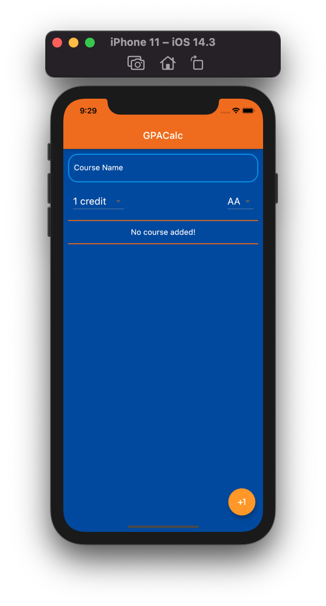
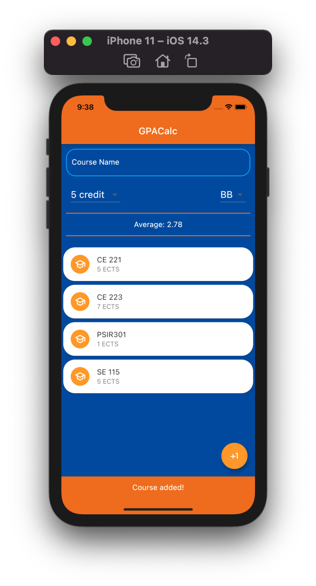
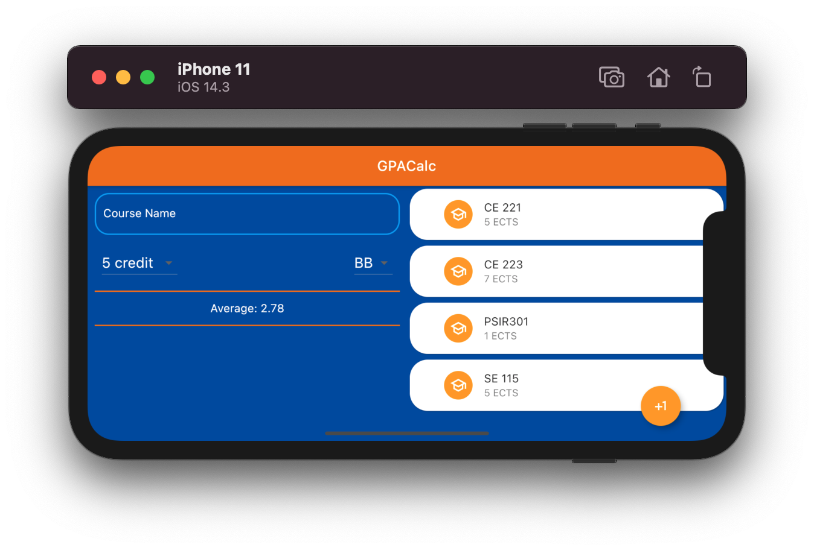

# GPACalc

A Flutter project that can calculate your GPA by adding and removing courses. Used OrientationBuilder to use this app in Landscape mode.

# GPACalc

Ders ekleyip çıkararak yılsonu ortalamınızı hesap edebileceğiniz bir Flutter projesi. Uygulamayı Landscape modunda kullanabilmek için OrientationBuilder kullanılmıştır.

###### Screenshots

